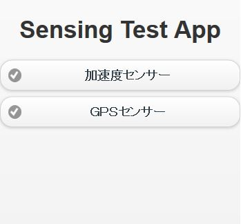
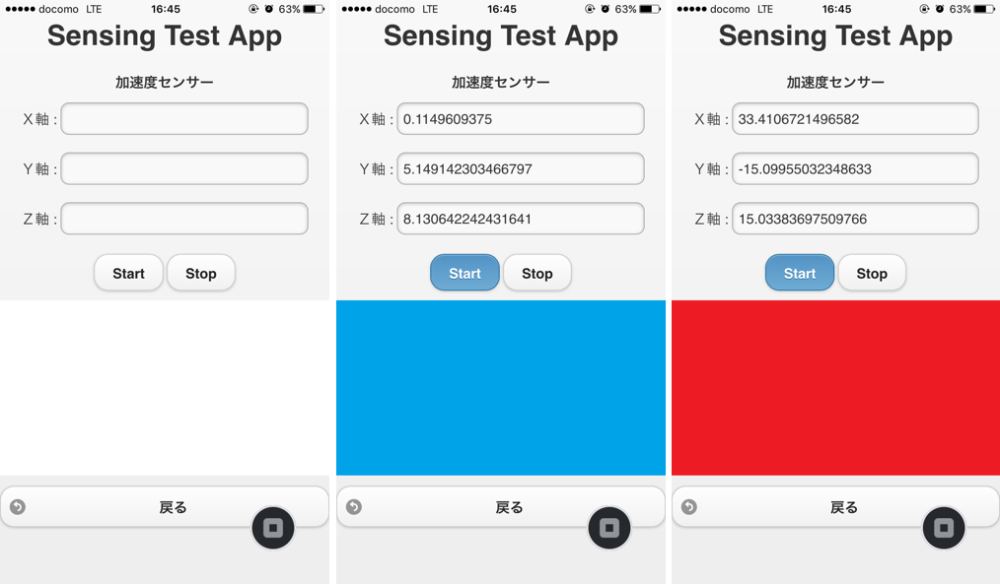

# 【IoT入門】スマホで加速度と位置情報を取得してクラウドに保存しよう！！

### ★加速度センサー

### ★ＧＰＳセンサー

## 概要
### マイコンとかセンサとかよく分からなくても楽しめるIoTを目指して・・・
最近ニフティクラウドmobile backendのハンズオンでIoTを扱うことが増えており、マイコン(Raspberry piやEdison)の使用したハンズオン検討していましたが難易度が高すぎ、初心者の方がついてこれなさそうで困っていました。
「マイコンやGPIOの配線などなど、電子工作と縁遠い人でもIoTを身近に感じ楽しめる内容を・・・」と考えたところ、多くの人が持っているスマホの「センサ」の値をクラウドに保存するコンテンツがよいのではないかと思いつき、今回のコンテンツを作りました。
内容をなるべく簡単にするため「HTML5」と「JavaScript」でスマホアプリの開発ができる「Monaca」を利用し「Andoridユーザー」でも「iPhoneユーザー」でも楽しめる内容としました。

### 加速度センサーとGPSセンサー
* スマホに元々備わっているセンサーの中でも、加速度センサーとGPSセンサーにアクセスして値を取得し、画面に表示させます。
* そのデータを使って、画面の色を変えてみたり、地図を表示したりします。
* 取得した値をサーバーに保存します。

## 事前準備
* [ニフティクラウドmobile backend](http://mb.cloud.nifty.com/?utm_source=community&utm_medium=referral&utm_campaign=sample_monaca_login_template)の準備
 * 利用登録
 * アプリの新規作成

* [Monaca](https://ja.monaca.io/) の準備
 * 利用登録
 * Monacaデバッガーのインストール
 * サンプルプロジェクトのインポート
　　※このページの「Download ZIP」を右クリックし、URLをコピー→Monacaで新規プロジェクトを作成時にインポートしてください。

 
 * [ニフティクラウドmobile backend](http://mb.cloud.nifty.com/?utm_source=community&utm_medium=referral&utm_campaign=sample_monaca_login_template)で新しいアプリを作成、APIキーの確認

 * 本ページ｢Download ZIP｣ボタンを右クリックしてサンプルプロジェクトURLをコピー→ [Monaca](https://ja.monaca.io/)にインポートし、プロジェクトを新規作成する。

## 作成手順
準備が整ったら、Monacaでプロジェクトを編集していきます。

### ・Cordvaプラグインを有効化する [設定済み]
* DeviceMotion : 加速度センサーを利用するためのプラグイン
* Geolocation : GPSセンサーを利用するためのプラグイン
* Splashscreen : スプラッシュスクリーンを利用するためのプラグイン

---------------------------------------
### ・ JavaScriptSDKの追加
 「設定」を選択→「JS/CSSコンポーネントの追加と削除…」を選択→検索欄に「NCMB」と入力して「検索」を押す→「追加」を押す

---------------------------------------
### ・js/app.js の編集
★(1)～(11)に次のコードを書いてください。
#### (1) APIキーの設定
mBaaSのコントロールパネルからアプリケーションキーとクライアントキーをコピーして貼り付けてください。

        var APPLICATION_KEY = "ここにあなたのアプリケーションキーを入力してください";
        var CLIENT_KEY = "ここにあなたのクライアントキーを入力してください";

#### (2) mBaaSの初期化

        ncmb = new NCMB(APPLICATION_KEY,CLIENT_KEY);

#### *Startボタン押下時の処理*
#### (3) 加速度センサーから値（x, y, z 軸）を取得する
        var watchId = navigator.accelerometer.watchAcceleration(onAcceSuccess, onAcceError, acceOptions);

#### (4) GPSセンサーから値（緯度経度）を取得する
        navigator.geolocation.getCurrentPosition(onGeoSuccess, onGeoError, geoOption);
        
#### *Stopボタン押下時の処理【加速度センサーの値を保存する】*
#### (5) データストアに保存用クラスを作成

        var AcceData = ncmb.DataStore("AcceData");

#### (6) クラスのインスタンスを生成
 
        var acceData = new AcceData();

#### (7) データの保存

         acceData.set("accelerometer", acce)  
                .save();

#### *Stopボタン押下時の処理【ＧＰＳセンサーの値を保存する】*
#### (8) データストアに保存用クラスを作成

        var GpsData = ncmb.DataStore("GpsData");

#### (9) クラスのインスタンスを生成
 
        var gpsData = new GpsData();

#### (10) 位置情報オブジェクトを作成

        var geoPoint = new ncmb.GeoPoint(); // (0,0)で生成
        geoPoint.latitude = lat;
        geoPoint.longitude = lng;

#### (11)  データの保存

        gpsData.set("geoPoint", geoPoint) 
               .save();
---------------------------------------
#### *コールバックとオプション メソッド* ［実装済み］

#### ・加速度センサーから値の取得に成功した場合のコールバック

        function onAcceSuccess(acceleration) {
            if(acce_flag){
                
                //直前の重力加速度のデータ
                var o_x = 0;
                var o_y = 0;
                var o_z = 0;
                
                //各軸の加速度データ
                document.acce_js.x.value=acceleration.x;
                document.acce_js.y.value=acceleration.y;
                document.acce_js.z.value=acceleration.z;
                
                //重力加速度を計算
                //基本的に重力加速度は端末の角度に対し「下」に働く
            	o_x = acceleration.x * 0.1 + o_x * (1.0 - 0.1);
            	o_y = acceleration.y * 0.1 + o_y * (1.0 - 0.1);
            	o_z = acceleration.z * 0.1 + o_z * (1.0 - 0.1);
            	
            	//重力加速度を抜いたそれぞれの軸の値
            	var last_x = acceleration.x - o_x;
            	var last_y = acceleration.y - o_y;
            	var last_z = acceleration.z - o_z;
    
                // センサーの値の変化を色で表示する
                if(Math.abs(last_x)>20 || Math.abs(last_y)>20 || Math.abs(last_z)>20){
                    document.getElementById("color").src="js/img/red.png";//赤
                }else if(Math.abs(last_x)>13 || Math.abs(last_y)>13 || Math.abs(last_z)>13){
                    document.getElementById("color").src="js/img/yellow.png";//黄
                }else{
                    document.getElementById("color").src="js/img/blue.png";//青
                }
    
                var acce = [acceleration.x,acceleration.y,acceleration.z];
                acce_array.push(acce);
            }
        };

#### ・加速度センサーから値の取得に失敗した場合のコールバック
        function onAcceError() {
            console.log('onAcceError!');
        };

#### ・加速度センサーから値をする時に設定するオプション
        var acceOptions = {
            // 取得する間隔を0.5秒に設定
            frequency: 500
        }; 

#### ・ＧＰＳセンサーから位置情報の取得に成功した場合のコールバック
        var onGeoSuccess = function(position){
            if(gps_flag){
                current = new CurrentPoint();
                //検索範囲の半径を保持する
                current.distance = CurrentPoint.distance;
                //位置情報(座標)を保存する
                current.geopoint = position.coords;
                $(".map").empty();
                writemap(current.geopoint.latitude,current.geopoint.longitude);
                document.gps_js.lat.value=current.geopoint.latitude;
                document.gps_js.lng.value=current.geopoint.longitude;
            }
        };

#### ・ＧＰＳセンサーから位置情報の取得に失敗した場合のコールバック
        var onGeoError = function(error){
            console.log("現在位置を取得できませんでした");
        };

#### ・ＧＰＳセンサーから位置情報をする時に設定するオプション
        var geoOption = {
            // 取得する間隔を１秒に設定
            frequency: 1000,
            // 6秒以内に取得できない場合はonGeoErrorコールバックに渡すよう設定
            timeout: 6000
        };

#### ・位置情報を保持するクラスを作成
        function CurrentPoint(){
            // 端末の位置情報を保持する
            geopoint=null;
            // 位置情報検索に利用するための検索距離を指定する
           distance=0;
        }

####　・位置情報を地図(OpenStreetMap)に表示する
        function writemap(lat,lon) {
            // 現在地の地図を表示
            map = new OpenLayers.Map("canvas");
            var mapnik = new OpenLayers.Layer.OSM();
            map.addLayer(mapnik);
            console.log(lat+":"+lon);
            var lonLat = new OpenLayers.LonLat(lon, lat)
                                       .transform(
                                           new OpenLayers.Projection("EPSG:4326"), 
                                           new OpenLayers.Projection("EPSG:900913")
                                        );
            map.setCenter(lonLat, 15);
    
            // 現在地にマーカーを立てる
            var markers = new OpenLayers.Layer.Markers("Markers");
            map.addLayer(markers);
    
            var marker = new OpenLayers.Marker(
                new OpenLayers.LonLat(lon, lat)
                              .transform(
                                  new OpenLayers.Projection("EPSG:4326"), 
                                  new OpenLayers.Projection("EPSG:900913")
                )
            );
            markers.addMarker(marker);
        }
---------------------------------------
### ・動作確認
* Monacaデバッガーを使って動作確してください。
* Startボタンを押すと
 * 加速度センサー：x,y,z軸の値を取得し画面に表示します。また、画面に表示された色によって、加速度の変化が簡単に読み取れるようになっています。振ってみてください。
 * ＧＰＳセンサー：緯度経度の値を取得し画面に表示します。またOpenStreetMapを使用して、地図に表示しています。
* Stopボタンを押すと
 * 加速度センサー：１秒ごとに取得した値（x,y,z軸の値の配列が秒ごとの配列として）がmBaaSに保存されます。
 * ＧＰＳセンサー：値が位置情報（緯度経度の値のペア）としてmBaaSに保存されます。

* mBaaSのダッシュボードより、｢データストア｣を選択すると、新たに｢AcceData｣,「GpsData」クラスが作られています。各クラスを選択すると保存されたデータを確認することができます。

## 付録
### *js/app.jsの完成版*
上手く動かなかった場合、以下をコピーして js/app.jsに貼り付けてください。その際、APIキーを書き換えてください。

        /** アプリケーションキーをかmBaaSからコピーして書き換えてください **/
        var APPLICATION_KEY = "YOUR_NCMB_APPLICATION_KEY";
        /** クライアントキーをかmBaaSからコピーして書き換えてください **/
        var CLIENT_KEY = "YOUR_NCMB_CLIENT_KEY";
    
        var ncmb;
        var acce_array;
        var acce_flag;
        var gps_flag;
        var current;
    
        // 起動時に実行
        $(function(){
            ncmb = new NCMB(APPLICATION_KEY,CLIENT_KEY);
            acce_array = new Array();
            acce_flag = new Boolean(false);
            gps_flag = new Boolean(false);
            current = null;
        });
    
        // 加速度センサーStartボタン押下時の処理
        function acce_start(){
            acce_flag = true; 
            var watchId = navigator.accelerometer.watchAcceleration(onAcceSuccess, onAcceError, acceOptions);
        }
    
        // 加速度センサーStopボタン押下時の処理
        function acce_stop(){
            acce_flag = false;
            acce_save_ncmb(acce_array);
            document.acce_js.x.value=null;
            document.acce_js.y.value=null;
            document.acce_js.z.value=null;
            document.getElementById("color").src="js/img/white.png";
        }
    
        // ＧＰＳセンサーStartボタン押下時の処理
        function gps_start(){
            gps_flag = true;
            navigator.geolocation.getCurrentPosition(onGeoSuccess, onGeoError, geoOption);
        }
    
        // ＧＰＳセンサーStopボタン押下時の処理
        function gps_stop(){
            gps_flag = false;
            gps_save_ncmb(current.geopoint.latitude,current.geopoint.longitude);
            document.gps_js.lat.value=null;
            document.gps_js.lng.value=null;
            $(".map").empty();
        }
    
        // 加速度の値を保存する
        function acce_save_ncmb(acce){
                var AcceData = ncmb.DataStore("AcceData");
                var acceData = new AcceData();
                acceData.set("accelerometer", acce)  
                        .save();        
        }
    
        // GPSの値を保存する
        function gps_save_ncmb(lat, lng){
                var GpsData = ncmb.DataStore("GpsData");
                var gpsData = new GpsData();
                var geoPoint = new ncmb.GeoPoint(); // (0,0)で生成
                geoPoint.latitude = lat;
                geoPoint.longitude = lng;
                gpsData.set("geoPoint", geoPoint) 
                       .save();
        }
    
        // 加速度センサーから値の取得に成功した場合のコールバック
        function onAcceSuccess(acceleration) {
            if(acce_flag){
                
                //直前の重力加速度のデータ
                var o_x = 0;
                var o_y = 0;
                var o_z = 0;
                
                //各軸の加速度データ
                document.acce_js.x.value=acceleration.x;
                document.acce_js.y.value=acceleration.y;
                document.acce_js.z.value=acceleration.z;
                
                //重力加速度を計算
                //基本的に重力加速度は端末の角度に対し「下」に働く
            	o_x = acceleration.x * 0.1 + o_x * (1.0 - 0.1);
            	o_y = acceleration.y * 0.1 + o_y * (1.0 - 0.1);
            	o_z = acceleration.z * 0.1 + o_z * (1.0 - 0.1);
            	
            	//重力加速度を抜いたそれぞれの軸の値
            	var last_x = acceleration.x - o_x;
            	var last_y = acceleration.y - o_y;
            	var last_z = acceleration.z - o_z;
    
                // センサーの値の変化を色で表示する
                if(Math.abs(last_x)>20 || Math.abs(last_y)>20 || Math.abs(last_z)>20){
                    document.getElementById("color").src="js/img/red.png";//赤
                }else if(Math.abs(last_x)>13 || Math.abs(last_y)>13 || Math.abs(last_z)>13){
                    document.getElementById("color").src="js/img/yellow.png";//黄
                }else{
                    document.getElementById("color").src="js/img/blue.png";//青
                }
    
                var acce = [acceleration.x,acceleration.y,acceleration.z];
                acce_array.push(acce);
            }
        };
    
        // 加速度センサーから値の取得に失敗した場合のコールバック
        function onAcceError() {
            console.log('onAcceError!');
        };
    
        // 加速度センサーから値をする時に設定するオプション
        var acceOptions = {
            // 取得する間隔を0.5秒に設定
            frequency: 500
        }; 
    
        //ＧＰＳセンサーから位置情報の取得に成功した場合のコールバック
        var onGeoSuccess = function(position){
            if(gps_flag){
                current = new CurrentPoint();
                //検索範囲の半径を保持する
                current.distance = CurrentPoint.distance;
                //位置情報(座標)を保存する
                current.geopoint = position.coords;
                $(".map").empty();
                writemap(current.geopoint.latitude,current.geopoint.longitude);
                document.gps_js.lat.value=current.geopoint.latitude;
                document.gps_js.lng.value=current.geopoint.longitude;
            }
        };
    
        // ＧＰセンサーから位置情報の取得に失敗した場合のコールバック
        var onGeoError = function(error){
            console.log("現在位置を取得できませんでした");
        };
    
        // ＧＰＳセンサーから位置情報をする時に設定するオプション
        var geoOption = {
            // 取得する間隔を１秒に設定
            frequency: 1000,
            // 6秒以内に取得できない場合はonGeoErrorコールバックに渡すよう設定
            timeout: 6000
        };
    
        // 位置情報を保持するクラスを作成
        function CurrentPoint(){
            // 端末の位置情報を保持する
            geopoint=null;
            // 位置情報検索に利用するための検索距離を指定する
            distance=0;
        }
    
        // 位置情報を地図(OpenStreetMap)に表示する
        function writemap(lat,lon) {
            // 現在地の地図を表示
            map = new OpenLayers.Map("canvas");
            var mapnik = new OpenLayers.Layer.OSM();
            map.addLayer(mapnik);
            console.log(lat+":"+lon);
            var lonLat = new OpenLayers.LonLat(lon, lat)
                                       .transform(
                                           new OpenLayers.Projection("EPSG:4326"), 
                                           new OpenLayers.Projection("EPSG:900913")
                                        );
            map.setCenter(lonLat, 15);
    
            // 現在地にマーカーを立てる
            var markers = new OpenLayers.Layer.Markers("Markers");
            map.addLayer(markers);
    
            var marker = new OpenLayers.Marker(
                new OpenLayers.LonLat(lon, lat)
                              .transform(
                                  new OpenLayers.Projection("EPSG:4326"), 
                                  new OpenLayers.Projection("EPSG:900913")
                )
            );
            markers.addMarker(marker);
        }